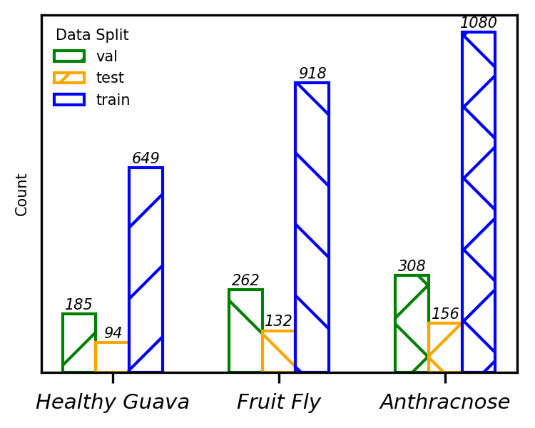
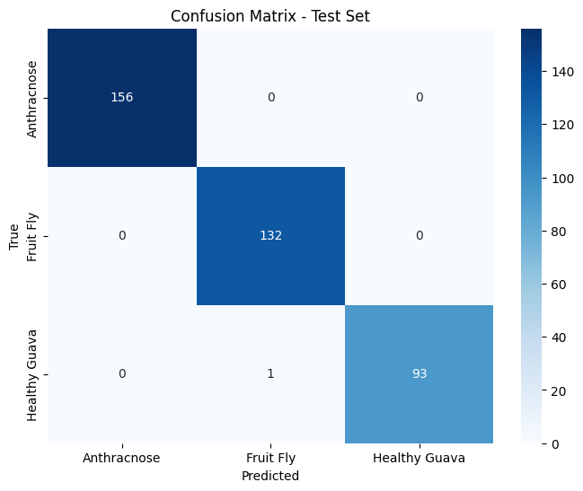

# Guava Disease Classification

## Group 6 Members
- **Muhammad Junaid Ali Asif Raja** (M11217073)  
- **Muhammad Aown Ali** (M11217077)

---

## Project Overview
This project focuses on classifying guava diseases into three categories:
- **Anthracnose**
- **Fruit Fly**
- **Healthy Guava**

The dataset used for this project was downloaded from [Kaggle: Guava Disease Dataset](https://www.kaggle.com/datasets/asadullahgalib/guava-disease-dataset), and class folders were renamed accordingly for better organization.

---

## Methodology

### 1. Model Architecture
The project leverages **DenseNet Reloaded**, a state-of-the-art architecture recently accepted in ECCV 2024. This architecture was implemented with the following enhancements:
- **RDNet_base code** was adapted from the popular `timm` library.
- **Pretrained weights** for `rdnet_base` were utilized for improved performance.

### 2. Optimization
The model was optimized using the **ADOPT optimizer**, a cutting-edge optimization algorithm accepted in NeurIPS 2024. This optimizer was adapted from the official repository: [ADOPT GitHub](https://github.com/iShohei220/adopt).

---

## Implementation Details

### Dataset Processing
- Dataset: [Kaggle: Guava Disease Dataset](https://www.kaggle.com/datasets/asadullahgalib/guava-disease-dataset)
- Class folders renamed to:
  - **Anthracnose**
  - **Fruit Fly**
  - **Healthy Guava**



### Model Initialization
The model was initialized using pretrained weights:
```python
model = timm.create_model('rdnet_base', pretrained=True)
```

### Key References
- **RDNet**: [GitHub Repository](https://github.com/naver-ai/rdnet)  
  - [RDNet Paper](https://arxiv.org/abs/2403.19588)
- **ADOPT Optimizer**: [GitHub Repository](https://github.com/iShohei220/adopt)  
  - [ADOPT Paper](https://arxiv.org/abs/2411.02853)

---

## Results

### Classification Report
```
               precision    recall  f1-score   support

  Anthracnose       1.00      1.00      1.00       156
    Fruit Fly       0.99      1.00      1.00       132
Healthy Guava       1.00      0.99      0.99        94

     accuracy                           1.00       382
    macro avg       1.00      1.00      1.00       382
 weighted avg       1.00      1.00      1.00       382
```

### Test Metrics
- **Test Top-1 Accuracy**: 99.7382%

### Confusion Matrix


The fine-tuned weights for this are available at this [link](https://drive.google.com/file/d/1RNgM-3hzG5NRGezBX93k27xYP0Qfp1kZ/view?usp=sharing).

---
### Requirements
We also provide the requirements file in the forms of `guava.yml` and `requirements.txt`.

   ```bash
   conda env create -f guava.yml
   ```
or
   ```bash
   pip install -r requirements.txt
   ```
---

## Acknowledgements
- RDNet_base code was exported from the `timm` library.
- ADOPT optimizer code was adapted from [iShohei220/adopt](https://github.com/iShohei220/adopt).
- Dataset courtesy of [Asadullah Galib](https://www.kaggle.com/asadullahgalib).

---

## License
This project is for academic purposes. Please refer to the original repositories for RDNet and ADOPT for licensing details.
